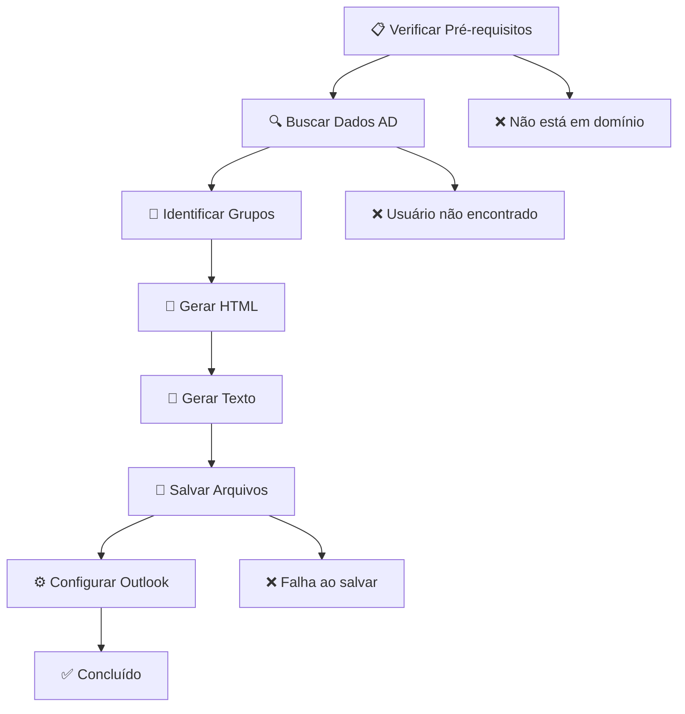

# 📧 AssinaturaEmail-Outlook

<div align="center">

[](https://docs.microsoft.com/en-us/powershell/)
[](https://www.microsoft.com/windows)
[](https://outlook.microsoft.com)
[](LICENSE)

**Script PowerShell automatizado para geração de assinaturas de email corporativas**

*Integração com Active Directory • Templates personalizáveis • Configuração automática do Outlook*

[🚀 Começar](#-instalação) • [📖 Documentação](#-uso) • [🤝 Contribuir](#-contribuição)

</div>

---

## ✨ Funcionalidades

### 🎯 **Principais Recursos**
- **🔗 Integração com Active Directory**: Busca automática de informações do usuário
- **🎨 Templates Dinâmicos**: Diferentes assinaturas baseadas em grupos do AD
- **⚙️ Configuração Zero**: Configura o Outlook automaticamente
- **🌐 Encoding Inteligente**: Conversão automática de caracteres especiais para HTML
- **📊 Logging Avançado**: Sistema de logs com múltiplos níveis de detalhamento
- **✅ Validação Robusta**: Verificação completa do ambiente antes da execução

### 🏢 **Casos de Uso**
- Padronização de assinaturas corporativas
- Onboarding automatizado de novos colaboradores
- Atualizações em massa de informações corporativas
- Compliance com políticas de marca da empresa

## 🛠️ **Tecnologias Utilizadas**

- **PowerShell 5.1+** - Core do script
- **Active Directory** - Integração LDAP
- **Windows Registry** - Configuração do Outlook
- **HTML/CSS** - Templates de assinatura
- **S3 AWS** - Hospedagem de imagens

## 🔧 Pré-requisitos

### **Sistema**
```powershell
# Sistema Operacional
Windows 10/11

# PowerShell
Version 5.1 ou superior

# Microsoft Outlook
Versões 2019, Office365 suportadas

# Rede
Conexão com domínio Active Directory
```

### **Permissões Necessárias**
- ✅ Acesso de leitura ao Active Directory
- ✅ Permissões de escrita em `%APPDATA%\Microsoft\signatures\`
- ✅ Permissões para modificar registro do Windows (HKCU)

## 🚀 Instalação

### **1. Clone o Repositório**
```powershell
git clone https://github.com/henriqzimer/AssinaturaEmail-Outlook.git
cd AssinaturaEmail-Outlook
```

### **2. Configure a Política de Execução**
```powershell
# Execute como Administrador
Set-ExecutionPolicy -ExecutionPolicy RemoteSigned -Scope CurrentUser
```

### **3. Execute o Script**
```powershell
# Execução básica
.\AssinaturaEmail.ps1

# Com parâmetros personalizados
.\AssinaturaEmail.ps1 -CompanyName "Sua Empresa" -Website "https://empresa.com" -Verbose
```

## 📖 Uso

##### **Link da Documentação:** https://www.henriqzimer.com.br

### **Execução Simples**
```powershell
.\AssinaturaEmail.ps1
```
> Busca automaticamente as informações do AD e gera a assinatura

### **Execução Avançada**
```powershell
.\AssinaturaEmail.ps1 -CompanyName "Sua Empresa" `
                      -Website "https://sua.empresa.com.br" `
                      -Encoding "utf8" `
                      -LogLevel "Verbose"
```

### **Parâmetros Disponíveis**

| Parâmetro | Tipo | Padrão | Descrição |
|-----------|------|--------|-----------|
| `CompanyName` | String | *AD Value* | Nome da empresa para sobrescrever valor do AD |
| `Website` | String | *AD Value* | Website da empresa para sobrescrever valor do AD |
| `Encoding` | String | `unicode` | Codificação do arquivo texto (`ascii`, `utf8`, `unicode`, `utf32`) |
| `LogLevel` | String | `Information` | Nível de log (`Error`, `Warning`, `Information`, `Verbose`) |

## 🏗️ Arquitetura

### **Fluxo de Execução**


### **Classes Principais**

<details>
<summary><strong>UserAccount</strong> - Classe para dados do usuário</summary>

```powershell
class UserAccount {
    [string]$DisplayName
    [string]$JobTitle  
    [string]$Department
    [string]$EmailAddress
    [string]$TelephoneNumber
    [bool]$IsFotoComercial
    [bool]$IsComex
    [bool]$IsNavigal
    # ... outras propriedades
}
```
</details>

<details>
<summary><strong>SignatureGenerator</strong> - Gerador de assinaturas</summary>

```powershell
class SignatureGenerator {
    [UserAccount]$User
    [hashtable]$Config
    
    [string] GenerateHTML()
    [string] GeneratePlainText()
    # ... outros métodos
}
```
</details>

## 📁 Estrutura de Arquivos Gerados

```
%APPDATA%\Microsoft\signatures\
├── Nome Empresa (usuario@sua.empresa.com.br).htm    # Assinatura HTML rica
└── Nome Empresa (usuario@sua.empresa.com.br).txt    # Assinatura texto simples
```

## 🐛 Solução de Problemas

### **Problemas Comuns**

<details>
<summary><strong>❌ Script não executa</strong></summary>

```powershell
# Verificar política de execução
Get-ExecutionPolicy

# Corrigir se necessário
Set-ExecutionPolicy -ExecutionPolicy RemoteSigned -Scope CurrentUser
```
</details>

<details>
<summary><strong>❌ Erro de permissão do AD</strong></summary>

```powershell
# Testar conectividade com AD
([ADSISearcher]"(&(objectCategory=person)(sAMAccountName=$env:USERNAME))").FindOne()
```
</details>

<details>
<summary><strong>❌ Assinatura não aparece no Outlook</strong></summary>

1. **Reiniciar o Outlook** completamente
2. **Verificar**: Arquivo > Opções > Email > Assinaturas  
3. **Executar novamente** com parâmetro `-Verbose`
4. **Verificar logs** para identificar erros específicos
</details>

### **Códigos de Saída**
- `0`: ✅ **Sucesso** - Assinatura gerada e configurada
- `1`: ❌ **Erro** - Falha durante execução (verificar logs)

## 📊 Sistema de Logs

### **Níveis de Log**
- 🔴 **Error**: Erros críticos que impedem a execução
- 🟡 **Warning**: Avisos que não impedem a execução  
- 🔵 **Information**: Informações gerais do processo
- 🟢 **Verbose**: Detalhes completos para debug

### **Exemplo de Log Detalhado**
```log
[2025-01-15 10:30:25] [Information] === Iniciando geração de assinatura ===
[2025-01-15 10:30:25] [Verbose] Verificando pré-requisitos...
[2025-01-15 10:30:26] [Information] Usuário encontrado: João Silva
[2025-01-15 10:30:26] [Verbose] Grupo 'Foto Comercial': True
[2025-01-15 10:30:27] [Information] Assinatura HTML salva
[2025-01-15 10:30:28] [Information] === Concluído com sucesso ===
```

## 🔒 Segurança e Conformidade

### **Medidas de Segurança**
- ✅ **Zero Credenciais**: Não armazena senhas ou tokens
- ✅ **Dados Públicos**: Usa apenas informações não-sensíveis do AD
- ✅ **Validação de Entrada**: Sanitização de todos os parâmetros
- ✅ **Logs Seguros**: Não registra informações confidenciais

### **Conformidade**
- 📋 **LGPD**: Processa apenas dados necessários e autorizados
- 🏢 **Política de Marca**: Garante consistência visual corporativa  
- ⚖️ **Aviso Legal**: Inclui automaticamente disclaimers obrigatórios

## 🤝 Contribuição

### **Como Contribuir**
1. 🍴 **Fork** o projeto
2. 🌱 **Crie** uma branch (`git checkout -b feature/NovaFuncionalidade`)
3. ✍️ **Commit** suas mudanças (`git commit -m 'Add: Nova funcionalidade'`)
4. 📤 **Push** para a branch (`git push origin feature/NovaFuncionalidade`)
5. 🔄 **Abra** um Pull Request

### **Padrões de Desenvolvimento**
- 📝 Comentários bem desenvolvidos
- 🎯 Seguir convenções PowerShell
- 🧪 Incluir testes para novas funcionalidades
- 📋 Documentar mudanças no CHANGELOG.md

## ⭐ Apoie o Projeto

Se este projeto te ajudou, considere:
- ⭐ **Star** no GitHub
- 🐛 **Reportar bugs** encontrados
- 💡 **Sugerir melhorias**
- 🤝 **Contribuir** com código

## 📄 Licença

Este projeto está licenciado sob a **Licença GPL v3.0** - veja o arquivo [LICENSE](LICENSE) para detalhes.

---

<div align="center">

**Desenvolvido com ❤️ para simplificar a vida corporativa**

[](https://linkedin.com/in/henrique-zimermann)
[](https://github.com/henriqzimer)

</div>